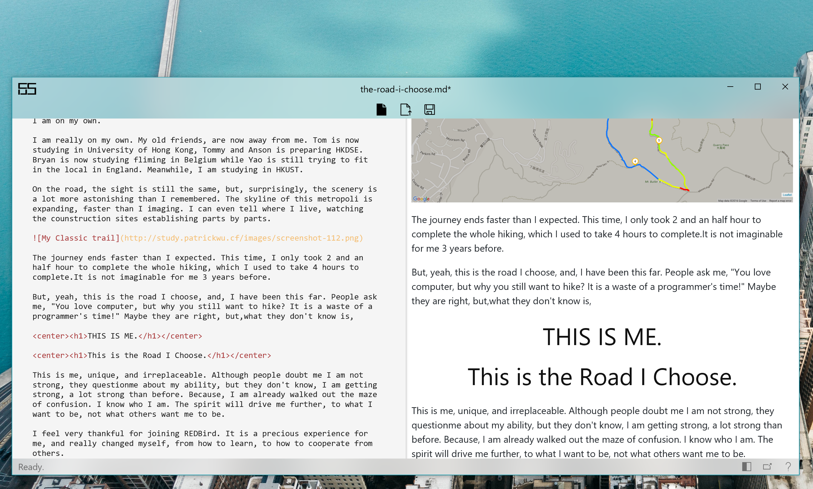

# Fcus

  

**Focus Writing; Mark Done.**

This is a minimal Markdown UWP editor made based on HTML5 and JavaScript.

## Contribute

**Feel free to contribute in this project!** Make sure to leave issues if the app is not working properly.

## License

Please be reminded that the license has changed to [MIT](https://github.com/patrick330602/Fcus/blob/master/LICENSE).

## Libraries

+ markdown-it 4.1.1
+ CodeMirror 5.1.1
+ highlight.js 9.12.0 
+ jQuery 3.2.1
+ js-deflate
+ UWP Community Toolkit 1.5.1
+ UDE.CSharp.UWP 1.0.1

## Credits

Referenced code from [Markdown.UWP](https://github.com/chenguanzhou/MarkDown.UWP) and [Markdown Editor](https://github.com/jbt/markdown-editor).

A big thanks to [@yinyue200](https://github.com/yinyue200) for implementing features of multiple instance and file association.

